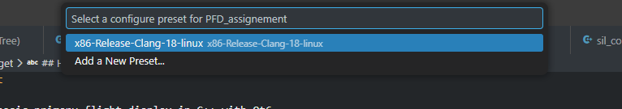
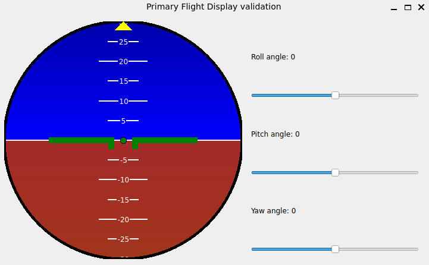

# Primary flight display widget

This widget implements a very basic primary flight display in C++ with Qt6
It uses pure C++ API of Qt (i.e. QPainter in a QWidget).
This is chosen so to avoid runtime interpretation like with a QML runner.

## How to build run and try

There is a "software in the loop" environment (a simple GUI called) under `software/software_in_the_loop`
This enable users to manually mocks data that would come from the flight computer.
To run the "software in the loop" use the Dev Container feature from VSCode (`CTRL+SHIFT+P` then "Dev Container: Reopen in container").
This will spare pain with installations of required dependency on host system.

Click on select the preset.



And then run the `software_in_the_loop` target.

**Note** the X11 forwarding is already enable by the [.devcontainer.json](.devcontainer/devcontainer.json#L4).  
**It may be required to run `xhost+` on hosts**



## How to integrate

The widget is available as a library under `software/primary_flight_display/`
The simply implements this slots.

```cpp
void updateAttitude(const QQuaternion& quaternion) noexcept;
```

Initialize the widget and connect tho this slots([See also](software/software_in_the_loop/mainwindow.cpp#L16))

## Notes on design and usage

When testing the widget with SIL, remember that there is no flight model behind the instrument itself therefoe some data may appear contraintuitive at first glance i.e.

- roll by 180 deg
- then increase the pitch
- the PFD places the aircraft nose in the sky. This is because these operation are not like "pulling up the stick while flying on the back" in a real aircraft (no flight model involved, the PFD simply display blindly the data coming from a flight computer. The SIL mocks the flight computer output.)

**Note** on Cardan locking:  
At Cardan lock position (+- 90 degree pitch, roll angles becomes irrelevant therefore the PFD display the aircraft unrolled.)
